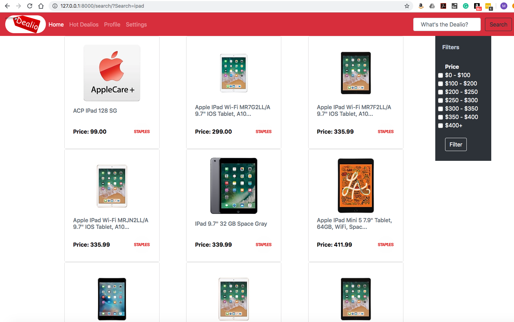

# USM CSC - 424 - Dealio

## Product Vision
For online shoppers who are always on the hunt for the best online deals, the What’s the Dealio web application will be an interactive, user-friendly resource that provides price comparison and a deal finder to search the world wide web for the best pricing and discounts of coveted products. Unlike typical online deals or coupons, our product provides a user account and involves data extraction from far reaches of the web in order to analyze and compile pricing data across websites that list the desired product and notify the user of any price change, which supports our strategy to provide the best deals for our users by focusing on their desired items.

## Screen Shots
<HTML>
      
</HTML>

## Required installs
* Python 3.7.
* Django 2.1.7
* Pycharm 2018.3.4
* mysql-python-connector 8.0.12

###Project Structure

dealio
- Settings.py
- urls.py

deals
- admin.py
- apps.py
- models.py
- tests.py
- views.py

Demos *(used only for sprint 1 will be restructured in sprint 3)*

media *(for dynamically imported media files like images and videos)*
- *folders by filetype (example: img for images)*

static *(for reference to static elements like images and css files)*
- css
- images

templates *(for HTML templates)*
- about.html
- base.html
- index.html
- search.html

manage.py